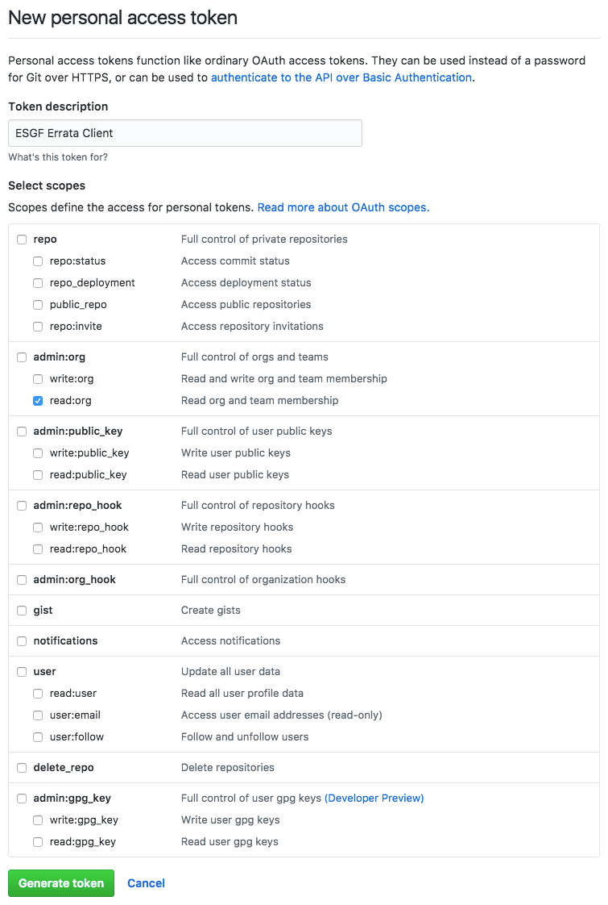
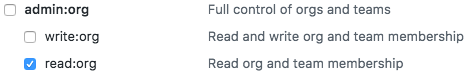

.. _configuration:

Authentication
==============

Authentication is key to an optimal use of the esgissue-client features.

GitHub setup
************

A verified GitHub account is required, as well as a personal access token generated through your github profile setting page: https://github.com/settings/profile

Make sure you associate a meaningful name and description for your newly generated token, to help you manage your tokens.
The next important step is to set the minimum required scope for your personal access token, Orgs:READ.
Limiting the number of scopes increases the security of your own personal data associated with your github account.

The authentication part is set by creating the personal access token.
For the authorization, a user needs to be part of the orgnization team specified for the institute he/she on behalf of which wishes to publish errata.
Authorization is controlled using github's organizations invitational based structure. The ESDoc-ERRATA admin is the only person qualified to add github users to the requested teams.

Credentials management
**********************

In order to ease the interactions with the ESDoc-ERRATA WS, a user can save the credentials for recurrent use.
This can be done either through environment variables:

.. code-block:: bash
    $> export ERRATA_CLIENT_GITHUB_TOKEN=xxxxxxxxxxxxxxxxxxxxxxxxxxxxxxxxx

This will enable the client to retrieve the token whenever the action requires it and stops it from prompting the user to type it in.
However setting the token on environment variables sets it up for grabs in clear text. For this reason an encrypted local file solution is
more encouraged to be employed by users. This file is encrypted using a chosen passphrase but it also is valid on the currently used machine only.
In order to generate your token local file:

.. code-block:: bash
    $> esgissue credset
    $> Token: xxxxxxxxxxxxxxxxxxxxxxxxxxxxxxxxxxxx
    $> Passphrase:
    $> 2017/01/03 05:25:42 PM INFO Your credentials were successfully set.

After declaring these credentials, the client will only ask user to provide the pass-phrase from now on.
In case the user forgets the passphrase the saved credentials can be reset using the command:

.. code-block:: bash

   $>esgissue credreset
   $>2017/01/03 11:54:35 AM INFO Credentials have been successfully reset.

This will obviously result in resetting the saved credentials, and the client will now ask for that information in the next usages.

In the case that the user does recall the pass-phrase and just wishes to modify it, this is possible using the following command:

.. code-block:: bash

   $>esgissue changepass  changepass --oldpass AtefBN --newpass ACatchyPassPhrase
   $>2017/01/03 12:30:04 PM INFO Passphrase has been successfully updated.

or

.. code-block:: bash

   $>esgissue changepass
   $>2017/01/03 04:45:59 PM INFO Old and new pass-phrases are required, if you forgot yours, use: esgissue credreset
   $>Old Passphrase: AtefBN
   $>New Passphrase: ACoolerPassPhrase
   $>2017/01/03 04:46:10 PM INFO Passphrase has been successfully updated.

This will prompt user to type in old and new passphrase.

In the event of wanting to remove your saved credentials that you have saved on your machine:

.. code-block:: bash

    $>esgissue credremove
    $>2017/01/03 05:29:57 PM INFO Credentials have been successfully removed.

