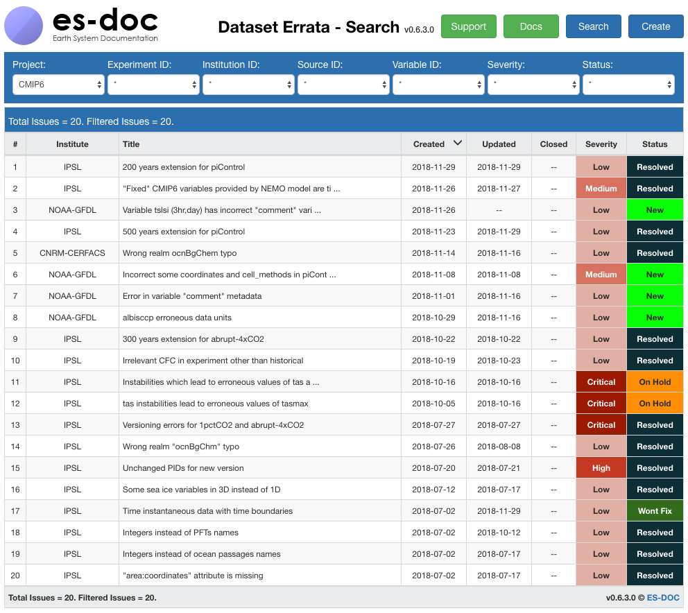
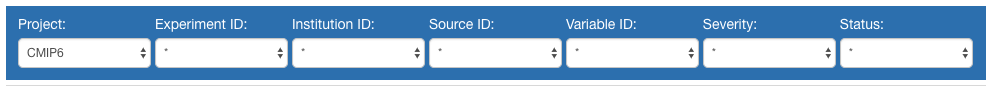
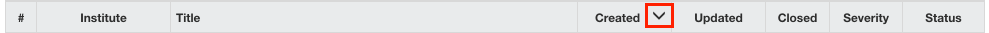

.. _searchUI:

Look up an issue
================

The `Errata Service home page <https://errata.es-doc.org/>`_ displays the whole list of known issues.

The list can be filtered by several useful parameters as:

    - the project,
    - some key facets (e.g., the experiment or the variable affected by the issue),
    - the issue severity,
    - the issue status.

All filters are value-controlled and can appear or disappear depending on the *Data Reference Syntax* of each project.

The list can also be sorted by clicking on the column headers.

The totals of known and filtered issues are displayed on top of the list.

